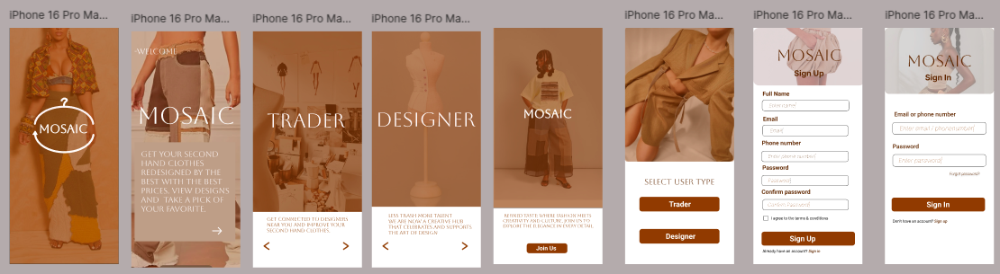

**MOSAIC OVERVIEW** 
The global fashion industry produces 10% of worldwide pollution, with unsustainable textile practices as a leading cause. In Kenya, the Gikomba market is the heart of the second-hand clothing(Mitumba) ecosystem, providing economic opportunity and affordable clothing. However, used and discarded clothing continues to feed landfills like Dandora, increasing the environmental burden. 

Our platform addresses this gap by connecting traders with designers for garment upcycling, aiming to turn waste into value and foster sustainable habits in the local fashion market. Through Mosaic traders are able to renew their unsold clothes while designers are able to use their talent to come up with unique designs.  
---
**How it works** 
**Traders** 
1. Sign up to the App 
2. Browse through the designs catalogue and pick out a design of their preference based on the unsold clothes materials that they have 
3. Add the item to the cart 
4. Finish the checkout process by picking the delivery method 
5. Deliver their unsold clothes and wait for delivery 
6. Pay for the new design upom delivery 
---
**Designers** 
1. Sign up 
2. Navigate to the uploads page  
3. Upload your designs by either browsing your gallery or taking a photo 
4. Click upload!
---
**Built with**
Mosaic is built with a combination of HTML, CSS, Javascript and Backend. 
---
**Interfaces sample images**

